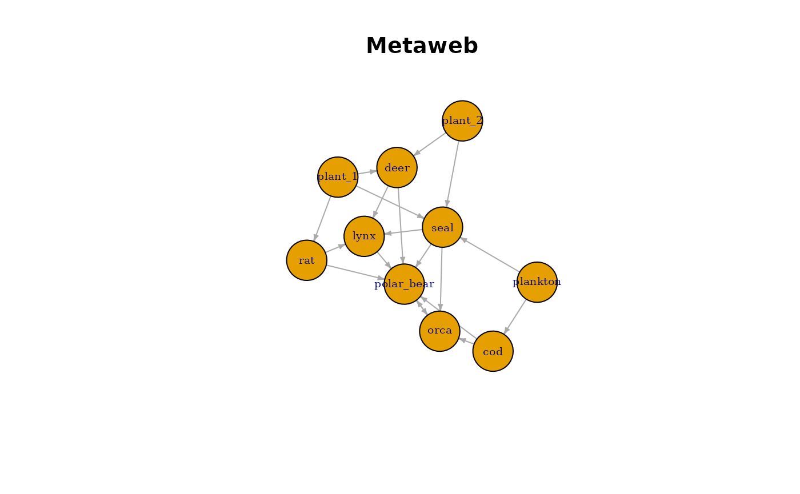

# Building a Metaweb

## Introduction

A metaweb represents the set of all potential consumer–resource
interactions in a system. In the context of paleoecology, the metaweb
captures interactions that are trait-compatible, even if they may not
all occur simultaneously in a realised community.

The PFWIM workflow allows users to infer these potential interactions
from species trait data and categorical feeding rules.

This vignette demonstrates how to: \* Infer a metaweb edgelist using
infer_edgelist() \* Convert the edgelist into an igraph network \*
Visualise the resulting food web

``` r
library(pfwim)
library(dplyr)
library(igraph)

data("traits", package = "pfwim")
data("feeding_rules", package = "pfwim")
```

## Inferring the Metaweb

The function
[`infer_edgelist()`](https://beckslab.github.io/pfwim/reference/infer_edgelist.md)
evaluates trait compatibility between species according to a set of
categorical feeding rules. It returns an edgelist, where each row
represents a feasible interaction.

``` r
metaweb_el <- infer_edgelist(
  data = traits,
  cat_combo_list = feeding_rules,
  col_taxon = "species",
  certainty_req = "all",
  hide_printout = TRUE
)

head(metaweb_el)
```

    ## # A tibble: 6 × 2
    ##   taxon_resource taxon_consumer
    ##   <chr>          <chr>         
    ## 1 cod            orca          
    ## 2 cod            polar_bear    
    ## 3 deer           lynx          
    ## 4 deer           polar_bear    
    ## 5 lynx           lynx          
    ## 6 lynx           polar_bear

Typical edgelists contain:

- *consumer* – the feeding species
- *resource* – the prey species

These edges define the structure of the potential food web.

## Converting the Edgelist to an igraph Network

The edgelist can be directly converted into an igraph object, which
allows users to compute network statistics and generate visualisations.

``` r
metaweb_graph <- graph_from_data_frame(
  metaweb_el,
  directed = TRUE
)

metaweb_graph
```

    ## IGRAPH 9c7b76b DN-- 10 22 -- 
    ## + attr: name (v/c)
    ## + edges from 9c7b76b (vertex names):
    ##  [1] cod       ->orca       cod       ->polar_bear deer      ->lynx      
    ##  [4] deer      ->polar_bear lynx      ->lynx       lynx      ->polar_bear
    ##  [7] orca      ->orca       orca      ->polar_bear plankton  ->cod       
    ## [10] plankton  ->seal       plant_1   ->deer       plant_1   ->rat       
    ## [13] plant_1   ->seal       plant_2   ->deer       plant_2   ->seal      
    ## [16] polar_bear->orca       polar_bear->polar_bear rat       ->lynx      
    ## [19] rat       ->polar_bear seal      ->lynx       seal      ->orca      
    ## [22] seal      ->polar_bear

## Visualising the Metaweb

Food webs are directed networks where edges flow from resource →
consumer.

``` r
set.seed(66)

plot(
  metaweb_graph,
  vertex.size = 35,
  vertex.label.cex = 0.6,
  edge.arrow.size = 0.3,
  layout = layout_with_fr(metaweb_graph),
  main = "Metaweb"
)
```



This visualisation represents the potential trophic structure of the
community based purely on trait compatibility.

Because all feasible interactions are included, metawebs are typically
much denser than observed ecological networks.
