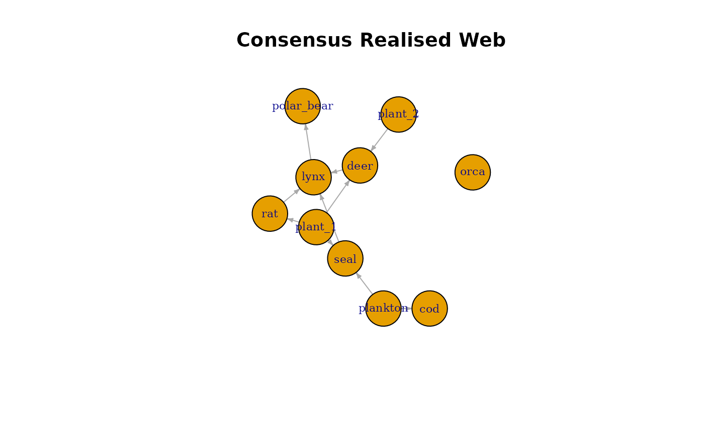
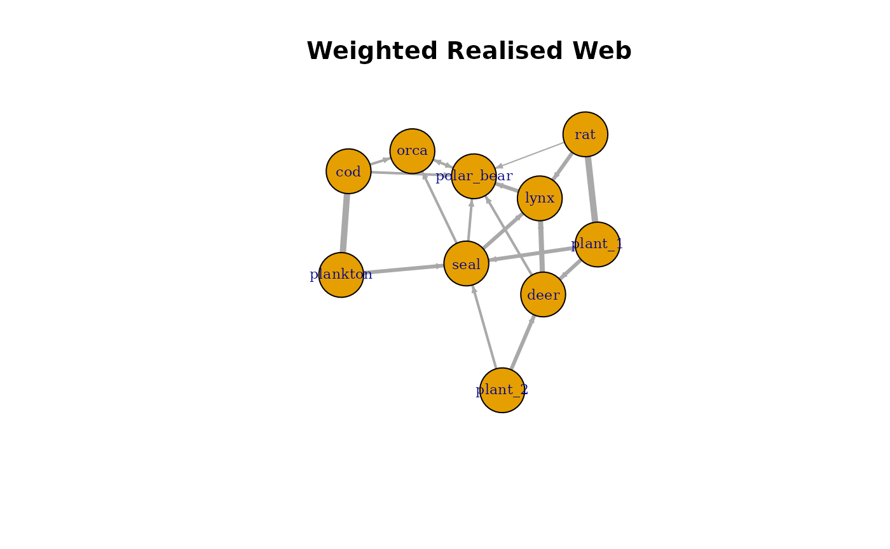

# Generating Realised Food Webs

## Introduction

The metaweb contains all trait-compatible interactions, but real
ecological networks typically contain far fewer links. To simulate
realistic food webs, PFWIM provides the function
[`powerlaw_prey()`](https://beckslab.github.io/pfwim/reference/powerlaw_prey.md),
which downsamples interactions from the metaweb according to a power-law
prey degree distribution.

This vignette demonstrates how to:

- Generate a metaweb edgelist
- Downsample interactions to create realised webs
- Compare the metaweb and realised networks using igraph

``` r
library(pfwim)
library(dplyr)
library(igraph)

data("traits", package = "pfwim")
data("feeding_rules", package = "pfwim")
```

## Generate the Metaweb

``` r
metaweb_el <- infer_edgelist(
  data = traits,
  cat_combo_list = feeding_rules,
  col_taxon = "species",
  certainty_req = "all",
  hide_printout = TRUE
)
```

## Generating Multiple Realised Webs

The function
[`powerlaw_prey()`](https://beckslab.github.io/pfwim/reference/powerlaw_prey.md)
randomly samples prey for each consumer according to a power-law
distribution, producing networks that more closely resemble empirical
food webs.

Because realised webs are generated via stochastic downsampling, it is
often useful to generate multiple network realisations. This allows
users to explore variability in network structure and perform
simulation-based analyses.

The argument `n_samp` controls how many realised webs are generated.

``` r
realised_webs <- powerlaw_prey(
  el = metaweb_el,
  n_samp = 5,
  y = 2.5
)
```

The result is a list of edgelists, where each element represents one
simulated realised food web.

``` r
length(realised_webs)
```

    ## [1] 5

Each entry in the list can be accessed individually.

``` r
realised_webs[[1]]
```

    ##      resource   consumer
    ## 9    plankton        cod
    ## 14    plant_2       deer
    ## 11    plant_1       deer
    ## 20       seal       lynx
    ## 3        deer       lynx
    ## 16 polar_bear       orca
    ## 7        orca       orca
    ## 2         cod polar_bear
    ## 22       seal polar_bear
    ## 4        deer polar_bear
    ## 19        rat polar_bear
    ## 12    plant_1        rat
    ## 10   plankton       seal

``` r
realised_webs[[2]]
```

    ##    resource   consumer
    ## 9  plankton        cod
    ## 11  plant_1       deer
    ## 5      lynx       lynx
    ## 20     seal       lynx
    ## 3      deer       lynx
    ## 21     seal       orca
    ## 1       cod       orca
    ## 2       cod polar_bear
    ## 12  plant_1        rat
    ## 10 plankton       seal

## Creating a consensus Realised Web

When generating multiple realised food webs, it can be useful to
construct a single representative network that summarises the
interactions observed across all simulations.

This can be done by counting how frequently each interaction occurs
across the simulated webs.

First, combine all realised edgelists into one table. Here the `.id`
column identifies which realised web each interaction came from.

``` r
library(dplyr)

combined_edges <- dplyr::bind_rows(
  lapply(realised_webs, as.data.frame),
  .id = "web_id"
)

head(combined_edges)
```

    ##   web_id   resource consumer
    ## 1  web_1   plankton      cod
    ## 2  web_1    plant_2     deer
    ## 3  web_1    plant_1     deer
    ## 4  web_1       seal     lynx
    ## 5  web_1       deer     lynx
    ## 6  web_1 polar_bear     orca

Next, count how often each interaction appears across the simulations.
The column `freq` indicates the number of realised webs in which each
interaction occurs.

``` r
edge_frequency <- combined_edges %>%
  count(resource, consumer, name = "freq")

edge_frequency
```

    ##      resource   consumer freq
    ## 1         cod       orca    2
    ## 2         cod polar_bear    2
    ## 3        deer       lynx    4
    ## 4        deer polar_bear    2
    ## 5        lynx       lynx    3
    ## 6        lynx polar_bear    3
    ## 7        orca       orca    3
    ## 8        orca polar_bear    1
    ## 9    plankton        cod    5
    ## 10   plankton       seal    3
    ## 11    plant_1       deer    3
    ## 12    plant_1        rat    5
    ## 13    plant_1       seal    3
    ## 14    plant_2       deer    3
    ## 15    plant_2       seal    2
    ## 16 polar_bear       orca    2
    ## 17 polar_bear polar_bear    1
    ## 18        rat       lynx    3
    ## 19        rat polar_bear    1
    ## 20       seal       lynx    3
    ## 21       seal       orca    2
    ## 22       seal polar_bear    2

A simple consensus rule is to keep interactions that appear in at least
half of the simulations. This produces a consensus realised web.

``` r
consensus_el <- edge_frequency %>%
  filter(freq >= 3)
```

## Visualising the Consensus Web

``` r
library(igraph)

consensus_graph <- graph_from_data_frame(
  consensus_el,
  directed = TRUE
)

plot(
  consensus_graph,
  vertex.size = 35,
  vertex.label.cex = 0.7,
  edge.arrow.size = 0.3,
  main = "Consensus Realised Web"
)
```



## Weighted Consensus Web

Instead of filtering interactions, one can construct a weighted network
where edge weights represent interaction frequency. In this case, the
`freq` column becomes the edge weight, representing how consistently
each interaction occurs across simulations.

``` r
weighted_graph <- graph_from_data_frame(
  edge_frequency,
  directed = TRUE
)

plot(
  weighted_graph,
  vertex.size = 35,
  vertex.label.cex = 0.7,
  edge.width = E(weighted_graph)$freq,
  edge.arrow.size = 0.3,
  main = "Weighted Realised Web"
)
```


